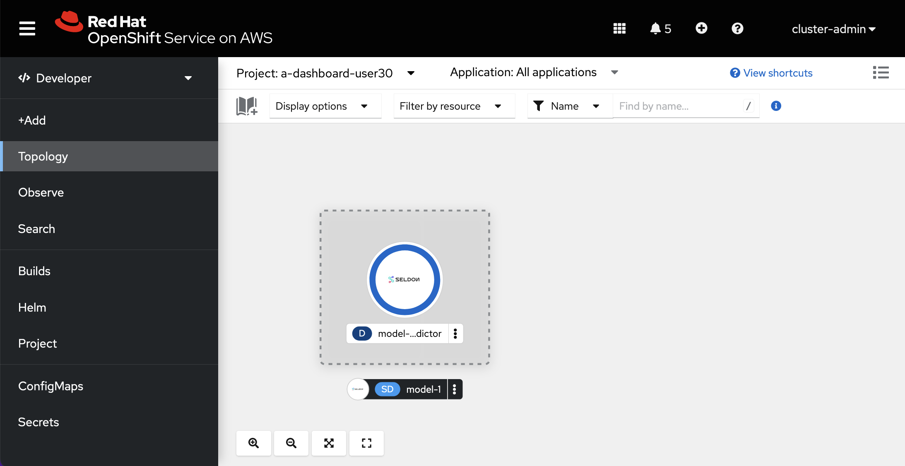
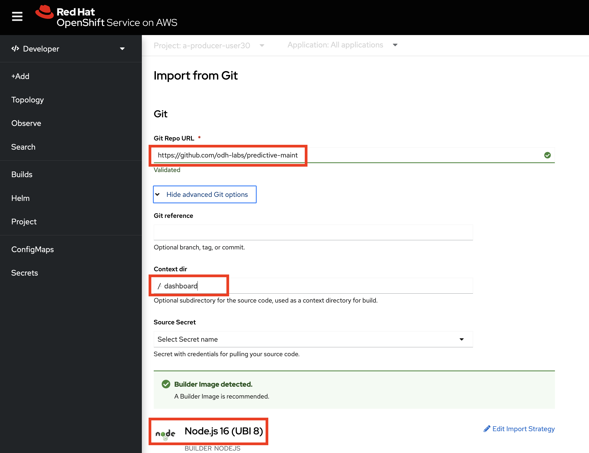

# Open Data Hub Workshop Setup Instructions

## Prerequisites
You'll need:
- An OpenShift 4.8 cluster - with admin rights. You can create one by following the instructions [here](http:/try.openshift.com), or via RHPDS (Red Hat staff only).
- the OpenShift command line interface, _oc_ available [here](https://docs.openshift.com/container-platform/4.6/cli_reference/openshift_cli/getting-started-cli.html)


## Download the Workshop Files

Using the example below:   
1. Clone (or fork) this repo.
2. Change directory into the root directory of the cloned repository **predictive-maint**.  
3. Create a variable *REPO_HOME* for this directory

```
git clone https://github.com/odh-labs/predictive-maint.git
cd predictive-maint
export REPO_HOME=`pwd`
```

## Install the Open Data Hub Operator

1. Log on to OpenShift as a Cluster Administrator. (For RHPDS this is opentlc-mgr.)
2. Click the *Perspective* dropdown list box
3. Click the *Administrator* perspective\
   OpenShift changes the user interface to the Adminstrator perspective.


4. Click **Operators > Operator Hub**  
   OpenShift displays the operator catalogue.  
5. Click the *Filter by keybord* text box and type *open data hub*  
   OpenShift displays the *Open Data Hub Operator* tile.
6. Click the tile  
   OpenShift displays a Commmunity Operator warning dialog box.
7. Click **Continue**  
   OpenShift displays the operator details.
8. Click **Install**   
   OpenShift prompts for the operator configuration details.   
     
9. Accept all defaults and click **Install**\
   OpenShift installs the operator and displays a dialog box once complete. 

The Open Data Hub Operator is now installed. 

## Install the Seldon Operator cluster wide

1. Click **Operators > Operator Hub**. Click the *Filter by keybord* text box and type *seldon*
   
   OpenShift displays the operator catalogue's **Community Seldon Operator** tile.


2. OpenShift displays a community operator warning. Accept it by **clicking *Continue***.

3. OpenShift displays the operator details. Click **Install**   
      
4. OpenShift prompts for the operator configuration details. Accept all defaults - ensuring  ***All namespaces on the cluster (default)*** is selected and click **Install**
 
   
5. OpenShift installs the operator and displays a confirmation box once complete a few minutes later.  

The Seldon Operator is now installed. 


## Login to you OpenShift cluster using the *Copy Login Command* facility.

  


## Configure and Add Workshop users

In this section, we'll configure 30 users. Modify script if you need a different number of users.

1. In a terminal window, type the following commands:
```
cd $REPO_HOME/setup
./setup-users.sh
```

After this script, both **_opentlc-mgr_** and **_user29_** have cluster-admin access.

If you need to create users with different credentials consult [this blog](https://medium.com/kubelancer-private-limited/create-users-on-openshift-4-dc5cfdf85661) - on which these instructions are based.


