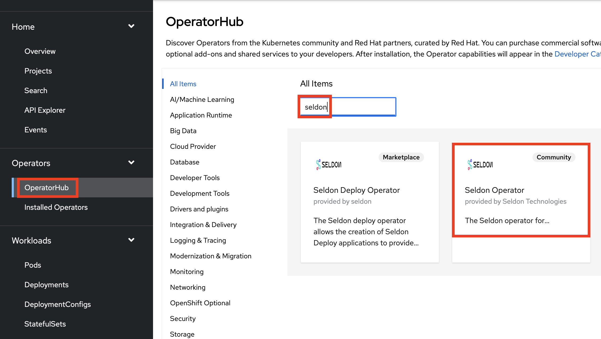
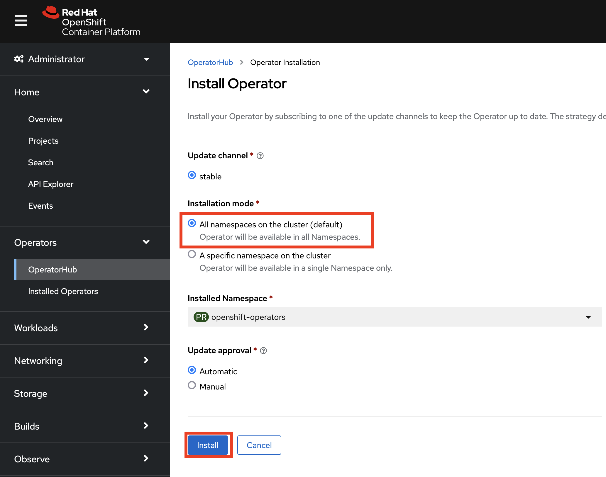
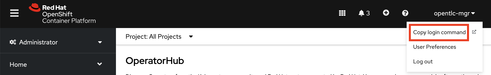

# Open Data Hub Workshop Setup Instructions

## Prerequisites

### Prerequisite 1 - Install the Red Hat OpenShift Application Services Command Line Interface (RHOAS CLI)
The CLI will be used to create and configure your Red Hat cloud based Kafka cluster and topic.
Run the following
```
curl -o- https://raw.githubusercontent.com/redhat-developer/app-services-cli/main/scripts/install.sh | bash
```
Add this to your system path.

### Prerequisite 2 - Install the Red Hat OpenShift Command Line Interface (oc CLI)
```
curl -o- https://raw.githubusercontent.com/redhat-developer/app-services-cli/main/scripts/install.sh | bash
```
Add this to your system path.

### Prerequisite 3 - Install the JQ Javascript manipulation tool.
This is required to extract data from JSON that the RHOAS CLI generates. It's available here:

[https://stedolan.github.io/jq/download/](https://stedolan.github.io/jq/download/)

### Prerequisite 4 - a Red Hat Account
Next, if you don't already have one, set up a free Red Hat Account - where the SaaS service, Red Hat OpenShift Service for Apache Kafka (RHOASAK) is located. Do that at **https://console.redhat.com**. Logout


### Prerequisite 4 - an OpenShift cluster - with admin rights.
Red Hatters and partners can use RHPDS. 

Others can create one by following the instructions [here](http:/try.openshift.com), or via RHPDS (Red Hat staff only).

We're now ready to begin. 


## Download the Workshop Files

Using the example below:   
1. Clone (or fork) this repo.
2. Change directory into the root directory of the cloned repository **predictive-maint**.  
3. Create a variable *REPO_HOME* for this directory

```
git clone https://github.com/odh-labs/predictive-maint.git
cd predictive-maint
export REPO_HOME=`pwd`
```

## Install the Open Data Hub Operator cluster wide

1. Log on to OpenShift as a Cluster Administrator. (For RHPDS this is opentlc-mgr.)
2. Click the *Perspective* dropdown list box
3. Click the *Administrator* perspective\
   OpenShift changes the user interface to the Adminstrator perspective.


4. Click **Operators > Operator Hub**  
   OpenShift displays the operator catalogue.  
5. Click the *Filter by keybord* text box and type *open data hub*  
   OpenShift displays the *Open Data Hub Operator* tile.
6. Click the tile  
   OpenShift displays a Commmunity Operator warning dialog box.
7. Click **Continue**  
   OpenShift displays the operator details.
8. Click **Install**   
   OpenShift prompts for the operator configuration details.   
     
9. Accept all defaults and click **Install**\
   OpenShift installs the operator and displays a dialog box once complete. 

The Open Data Hub Operator is now installed. 


## Install the Seldon Operator cluster wide

1. Click **Operators > Operator Hub**. Click the *Filter by keybord* text box and type *seldon*
   
   OpenShift displays the operator catalogue's **Community Seldon Operator** tile.


2. OpenShift displays a community operator warning. Accept it by **clicking *Continue***.

3. OpenShift displays the operator details. Click **Install**   
 

4. OpenShift prompts for the operator configuration details. Accept all defaults - ensuring  ***All namespaces on the cluster (default)*** is selected and click **Install**
 
   
5. OpenShift installs the operator and displays a confirmation box once complete a few minutes later.  

The Seldon Operator is now installed. 


## Login to you OpenShift cluster using the *Copy Login Command* facility.

  


## Configure and Add Workshop users

In this section, we'll configure 30 users. Modify script if you need a different number of users.

1. In a terminal window, type the following commands:
```
cd $REPO_HOME/setup
./setup-users.sh
```

After this script, both **_opentlc-mgr_** and **_user29_** have cluster-admin access.

If you need to create users with different credentials consult [this blog](https://medium.com/kubelancer-private-limited/create-users-on-openshift-4-dc5cfdf85661) - on which these instructions are based.


## Create a project for Model training
As a Cluster Administrator, run the following
```
oc new-project ml-workshop
oc delete limits ml-workshop-core-resource-limits
```
This name *ml-workshop* is expected by the data science components in the training folder of the Git repo (https://github.com/odh-labs/predictive-maint).
We delete limits, as some systems like Red Hat's RHPDS, impose resource limts too restrictive for us.


## Allocate enough resources for the demo/workshop
As a Cluster Administrator, add sufficient MachineSets/Nodes to cater for your class size. This has been roughly calculated at one AWS m5.4xlarge Machine per user. Though this calculation needs to be retested and refined - as it is likely too much.