# Setting up the Inference Demo


### Prerequisite 1 - Install the Red Hat OpenShift Application Services Command Line Interface (RHOAS CLI)
The CLI will be used to create and configure your Red Hat cloud based Kafka cluster and topic.
Run the following
```
curl -o- https://raw.githubusercontent.com/redhat-developer/app-services-cli/main/scripts/install.sh | bash
```
Add this to your system path.

### Prerequisite 2 - Install the Red Hat OpenShift Command Line Interface (oc CLI)
```
curl -o- https://raw.githubusercontent.com/redhat-developer/app-services-cli/main/scripts/install.sh | bash
```
Add this to your system path.

### Prerequisite 3 - Install the JQ Javascript manipulation tool.
This is required to extract data from JSON that the RHOAS CLI generates. It's available here:

[https://stedolan.github.io/jq/download/](https://stedolan.github.io/jq/download/)

### Prerequisite 4 - a Red Hat Account
Next, if you don't already have one, set up a free Red Hat Account - where the SaaS service, Red Hat OpenShift Service for Apache Kafka (RHOASAK) is located. Do that at **https://console.redhat.com**. Logout


### Prerequisite 4 - an OpenShift cluster, a Username and an OpenShift project to work in
If you are part of a workshop, your instrutor will supply these to you in the Web Meeting Chat. We'll refer to these below as
```
YOUR OPENSHIFT PRODUCER PROJECT	
YOUR OPENSHIFT DASHBOARD PROJECT
YOUR OPENSHIFT USERNAME	
YOUR OPENSHIFT PASSWORD
OPENSHIFT CLUSTER URL
```
We're now ready to begin. 

## 1 - Setup Kafka Cluster on Red Hat OpenShift Streams for Apache Kafka (RHOSAK)
In this section, we're going to automate the creation and configuration of your Kafka streaming service and slot the values from ***your*** new Kafka configuration into various source files so they're ready to use later. Your Kafka streaming service is where
 - images will be sent from your laptop in realtime
 - those same images will be pulled in realtime for your inferencing application on OpenShift

Now, in a terminal terminal, clone this repoistory, change to its directory and set the REPO_HOME environment variable.
```
git clone https://github.com/odh-labs/predictive-maint
cd predictive-maint
export REPO_HOME=`pwd`
```

Next, run the following Kafka automation script
```
cd $REPO_HOME/deploy
. ./kafka.sh
```

You'll be prompted login to your Red Hat Account (you set up previously). A confirmation page like the following will appear on your browser

 


This script will take several minutes to complete. Keep the terminal open, allowing it to continue the Kafka configuration. 
Feel free to continue from the section below 
***2 - Login to OpenShift and select your OpenShift producer project*** - and come back to the script after 6-7 minutes


### Confirm your Kafka installation
After 5-7 mins, your ***kafka.sh*** script should have completed successfully.
Verify it by doing the following:
- Scan your terminal output - it should have run to completion with no errors. The end should look something like this if it was successful:
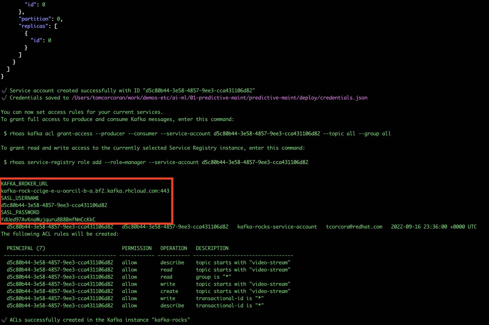

Copy these 3 values to a text file - you'll need them later

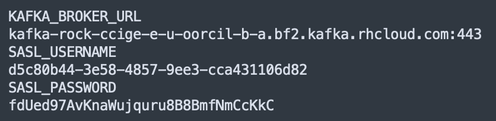

#### Verify creation of your cloud based Kafka service (RHOASAK)
- navigate to [https://console.redhat.com/application-services/streams/kafkas](https://console.redhat.com/application-services/streams/kafkas)
and you should see a new Kafka cluster called  ***kafka-rocks*** created.


#### Verify your ***consumer-deployment.yaml*** file. 
We have a simple OpenShift based application that you will run shortly which
- pulls images from our video-stream Kafka topic
- for each one, it calls the AI model for a prediction on what each image contains
- writes the count of what it found out to our Object Storage Minio
  
In the ***kafka.sh*** automation script we ran earlier, we configured ***consumer-deployment.yaml*** with various values relating to your Kafka installation. [This link shows you the original part of consumer-deployment.yaml](https://github.com/odh-labs/predictive-maint/blob/main/deploy/consumer-deployment.yaml#L49-L54) before we substitued those values. Notice we have 3 placeholders:

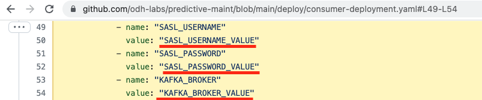

These 3 placeholders in your consumer-deployment.yaml should ***now have your values*** . To verify this has been successful, run the following and navigate down to lines 49-54.
```
cat $REPO_HOME/deploy/consumer-deployment.yaml
```
It should look something like this - though your values will be different:


## 2 - Login to OpenShift and select your OpenShift producer project

#### Login to your OpenShift cluster using both browser and terminal
1. Log on to OpenShift - by hitting the URL ***OPENSHIFT CLUSTER URL*** you got off the Web Meeting Chat earlier. You'll see this screen. Click **openshift-users** 
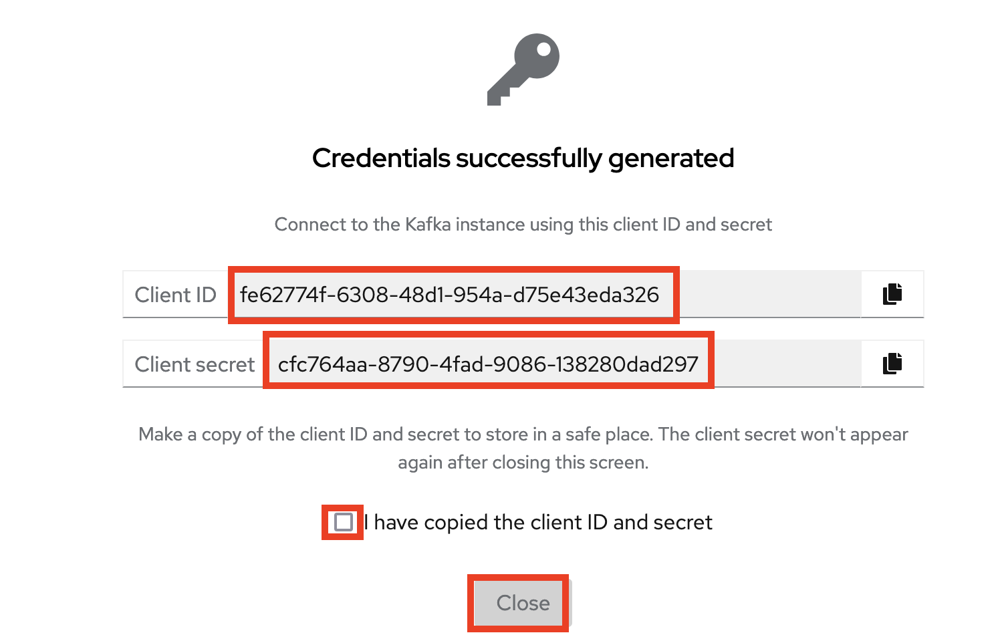
2. Enter these values    
   - ***YOUR OPENSHIFT USERNAME*** that you got earlier from your instructor
   - ***openshift*** for your password 
3. Click **Log In**
 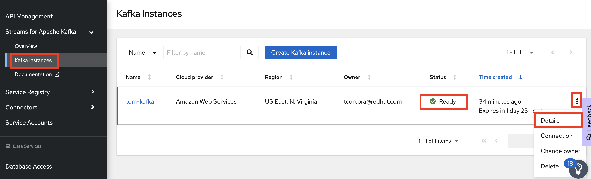 

4. Click the *Perspective* dropdown list box
5. Click the *Administrator* perspective\
   OpenShift changes the user interface to the Adminstrator perspective.
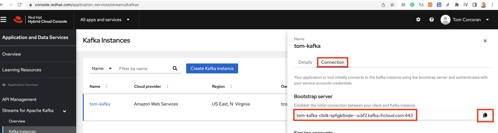
6. Click your username on the top right of the screen, then click *Copy Login Command*
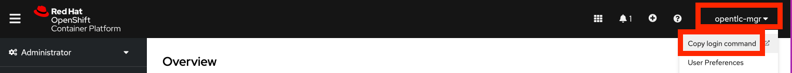

Log in and click **Display Token**. 

Copy the entire ***oc login*** command as far as ***6443*** and paste into your terminal window inside virtual box. Accept the *insecurity* warning.


**If you ARE in a workshop**, select your producer project inside the terminal window. Run the following replacing ***YOUR OPENSHIFT PRODUCER PROJECT	*** with yours
   ```
   oc project <insert YOUR OPENSHIFT PRODUCER PROJECT here>
   ```
   i.e. in my case, as I'm user30:

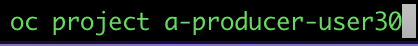 

**If you are NOT in a workshop**, run the following
   ```
   oc new-project a-producer
   ```

#### Configure your OpenShift image producer project
We will use a NodeJS based application to capture images from your webcam and send them to Kafka. (Actually we will only send 1 per second as that's sufficient - and will ease the load on Kafka and associated compute and staorage costs).
In a production situation, at the edge, we might run this using Podman or Docker - but as we have access to an OpenShift cluster, we'll use that.

Now on the OpenShift Web console (either within or outside your Virtual box VM), navigate to Home > Projects and click ***YOUR OPENSHIFT PRODUCER PROJECT	***, in my case *a-producer-user30*
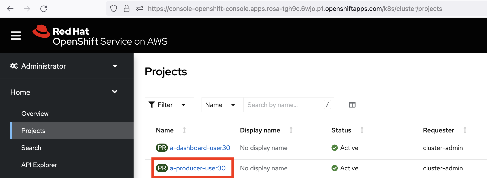 

Next, switch to Developer perspective by selecting it on the dropdown on the top left of the screen.
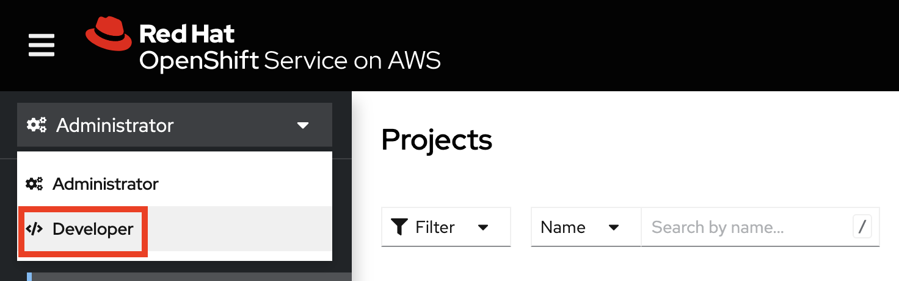 

Skip the tour if you get a popup offering a tour.

Click **Add** then **Import from Git**
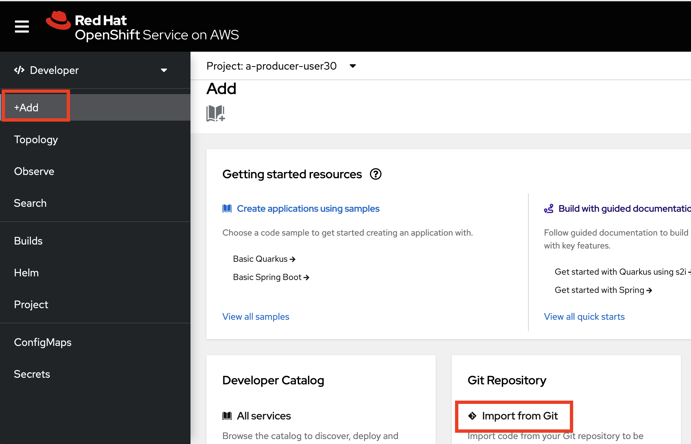 
Make the following 2 entries as shown in screenshot below (you may need to expand Advanced Git Options). Leave the rest of the values as their defaults 
```
Git Repo URL:         https://github.com/odh-labs/predictive-maint
Context:              /event-producer-js
```
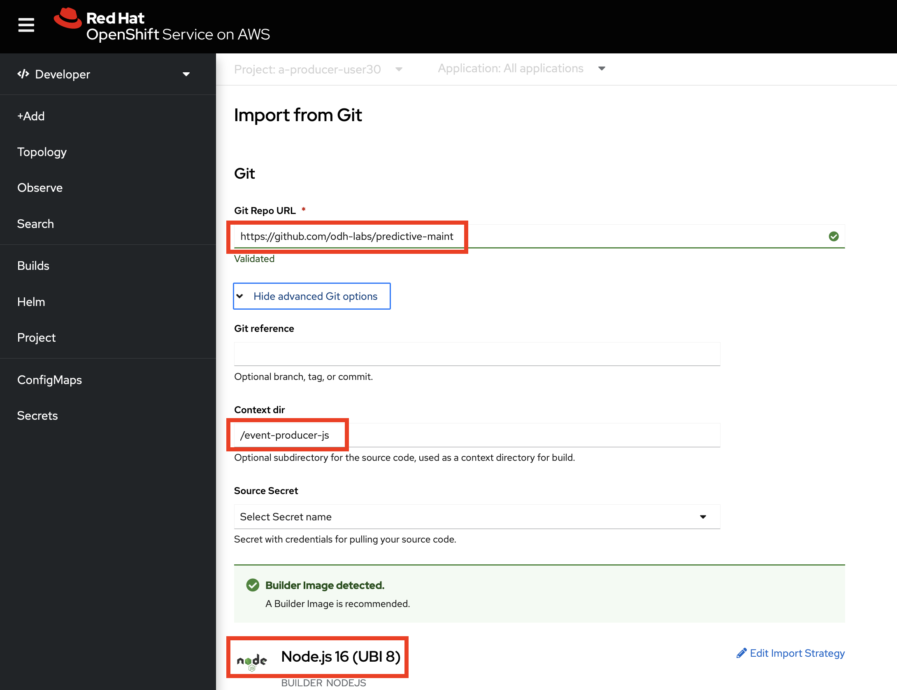 

Notice OpenShift's Source to Image capabilities picked up it's a Node JS application.

Scroll down and enter **producer** for both the Application and Name entries , then click **Deployment** on the bottom:
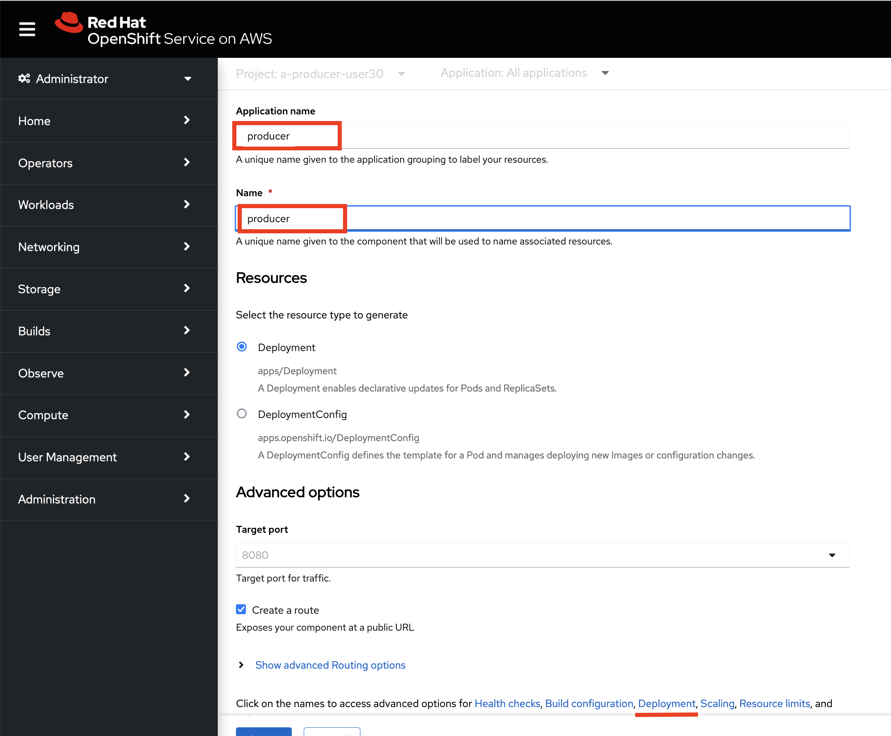 

Scroll down to Add Value and click it twice - to allow 3 environment variables to be entered. Enter the values saved to a text file earlier and click **Create**. 
```
KAFKA_BROKER_URL
SASL_USERNAME
SASL_PASSWORD
```

 

Soon after - it will build the application then deploy it. Click the **producer** deployment and when the build is done and the pod is ready, scroll down and click the Route

 

You'll get a warning the application is trying to access your webcam - accept that warning.
 

You should see yourself on the screen. Don't click start yet.
 


## 3 - Install the controller, AI, storage and dashboard components

Now we'll configure 
 - the controlling application that pulls images from Kafka, calls the AI and pushes the results to object storage
 - the AI model exposed using Seldon as a RESTful API,
 - lightweight S3 object storage implemented using Minio. Here we will store the count of the number of times the AI detected what it did (person or background),
 - the dashboard HTML page that shows in realtime what the AI model is detecting.


**If you are NOT in a workshop**, run the following (a-dashboard is YOUR OPENSHIFT DASHBOARD PROJECT)
   ```
   oc new-project a-dashboard
   ```

Now both on screen and in your terminal, select YOUR OPENSHIFT DASHBOARD PROJECT.
In a terminal do that using the oc comand as follow - substitutuing in YOUR OPENSHIFT DASHBOARD PROECT
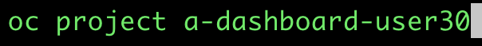 

On your OpenShift web console, select the dropdown and select your YOUR OPENSHIFT DASHBOARD PROJECT - as shown.
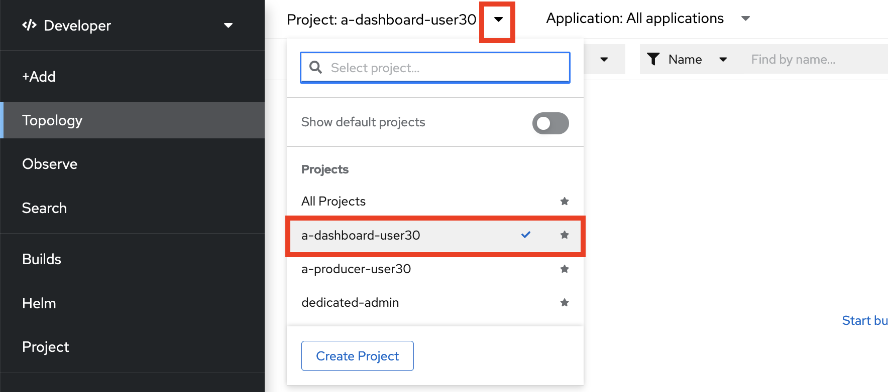 


Now we have the project selected, we can do our installs.

1. Seldon is an awesome tool to expose an AI model behind a RESTful API. In your terminal, run the following to install Seldon
  ```
   oc apply -f $REPO_HOME/deploy/Seldon-Deployment.yaml
   ```
   In order to see the visual Topology dashboard, click the icon shown on the top right of the Topology screen.
   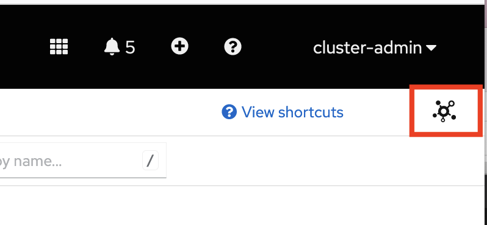
   You should now see the Seldon deployment - that a few minutes later will change colour to dark blue, indicating it has completed.
   


2. Next we deploy our lightweight S3 object storage Minio implementation. Run the following in a terminal:
  ```
   oc apply -f $REPO_HOME/deploy/minio-full.yaml
   ```
   Shortly after, you should see a completed Minio job and deployment on your visual Topology dashboard along with Seldon.

   By default, an S3 *Bucket* is created in Minio, called image-prediction. This is private by default - we need to make this public.
   - Switch to the Administrator view and navigate to *Networking Routes*. Click on the Minio UI URL
    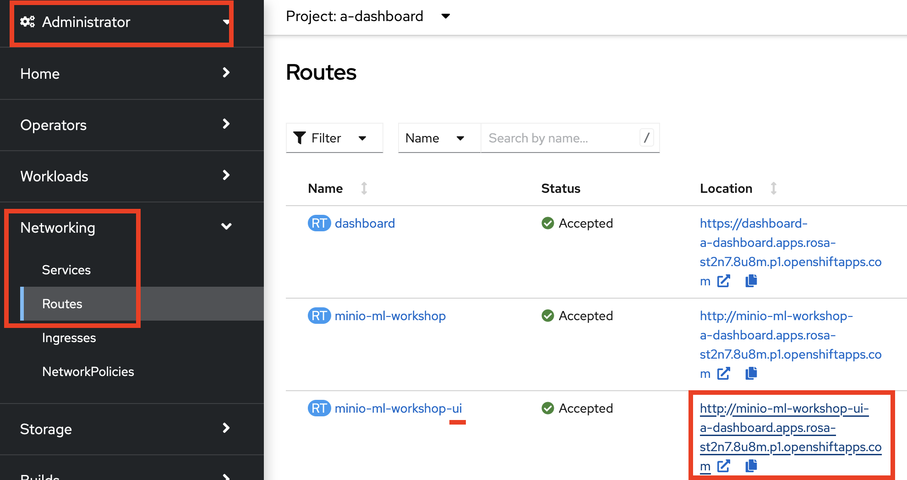

   - Enter the credentials *minio / minio123*
     
     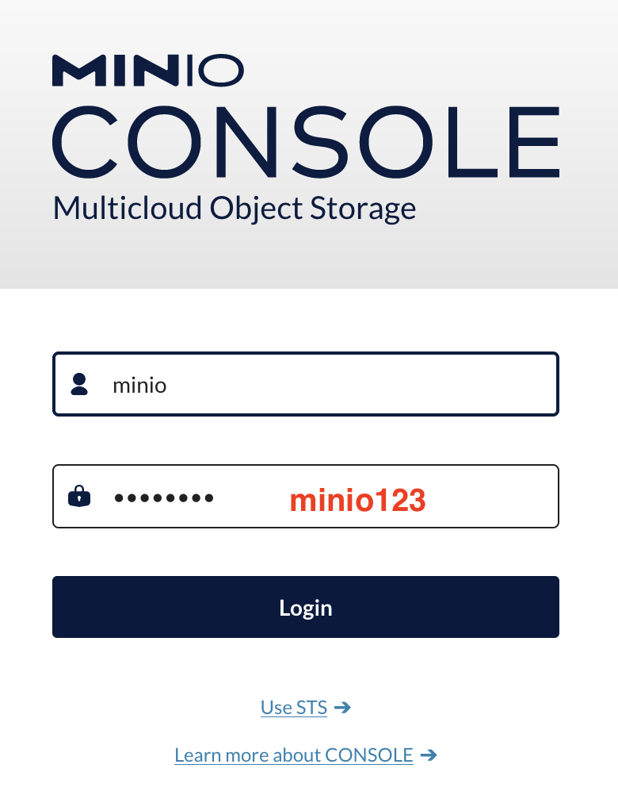
   
   - You should see this image-prediction by default. If not Navigate to *Buckets* on the left and then to it. 
   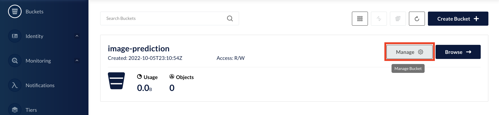

 

3. Next we deploy our controlling application that pulls images from Kafka, calls the AI and pushes the results to object storage. Run the following in a terminal:
  ```
   oc apply -f $REPO_HOME/deploy/consumer-deployment.yaml
   ```
   Shortly after, you should see that completed on your visual Topology dashboard.

4. Finally, we need to set up our dashboard web page that displays the count of what your webcam is seeing and the AI is detecting in real time.


Click **Add** then **Import from Git**
Make the following 2 entries as shown in screenshot below (you may need to expand Advanced Git Options). Leave the rest of the values as their defaults 
```
Git Repo URL:         https://github.com/odh-labs/predictive-maint
Context:              /dashboard
```
 

Notice OpenShift's Source to Image capabilities picked up it's a Node JS application.

Scroll down and enter **dashboard** for both the Application and Name entries , then click **Deployment** on the bottom:
 

Scroll down to the Environment variables section and enter the following then click **Create**. 
```
MINIO_URL       http://minio-ml-workshop:9000
```

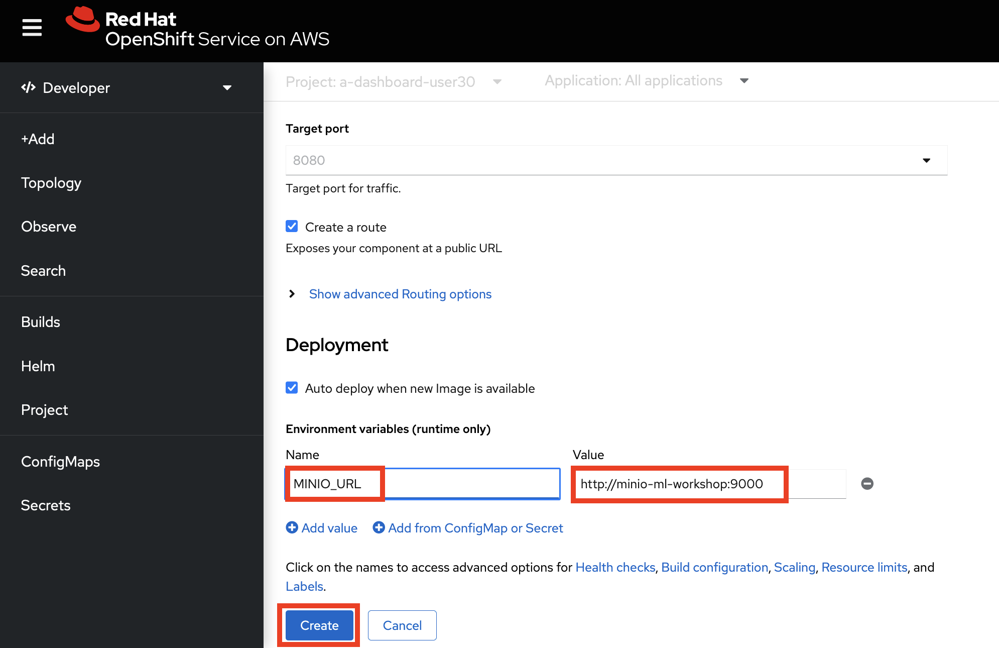 

Soon after - it will build the application then deploy it. Your tolpolgy should now contain the following compnents - fully deployed. Click the Route icon on the dashboard Node Js deployment as shown in red.

 

You should see this web page. Don't click start yet.
 


## 6 - Setup Complete
Now your inference application is ready. We'll use it in the next instruction file, [Run End to End Inference Demo](https://github.com/odh-labs/predictive-maint/blob/main/docs/image-detection-2-inference-demo.md)

