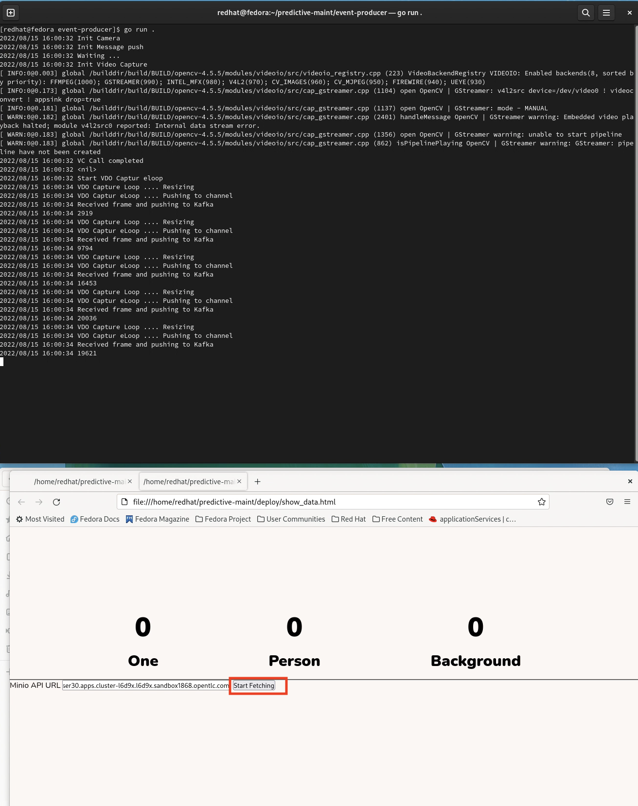
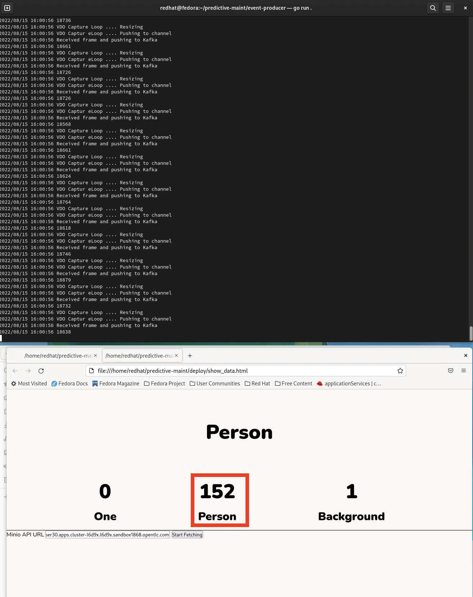
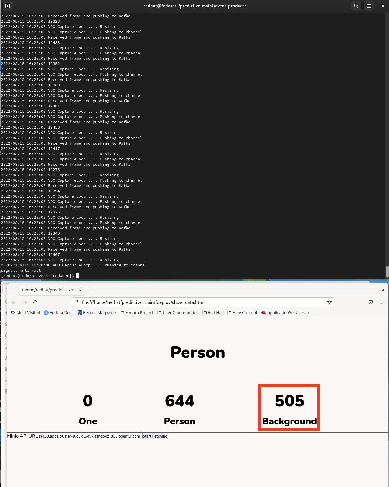

# Running the Inference Demo


## 1 - Start your Image Capture on the producer web page
You should already have opened this page while [setting up the inference demo](https://github.com/odh-labs/predictive-maint/blob/main/docs/image-detection-1-inference-demo-setup.md). You should see yourself on the screen. Click start to begin capturing images and sending them to Kafka.
 


## 2 - Start your Dashboard web page\
Now it's time to start your Dashboard web page - to detect what the AI model is detecting in real time


You should already have opened this page while [setting up the inference demo](https://github.com/odh-labs/predictive-maint/blob/main/docs/image-detection-1-inference-demo-setup.md). You should see yourself on the screen. **Click Start** to begin polling S3 object storage for what the AI is detecting
 


## 3 - Summary Recap

The diagram below summarises what is happeing in this demo
- an Edge based image capture/producer application pulls images in realtime from your webcam. The AI Model ihas been trained to recognise people - or anything else - which is labels as *background*. This capture/producer application is running on Kuberntees (OpenShift) but it could easily be modified to run something like podman or docker - suitable in low power edge environments
- This capture/producer application pushes images (1 per second) to a cloud based Kafka service hosted by Red Hat.
- on AWS a controlling application, a Kubernetes (OpenShift) ***pod*** does the following
  
  1) sends each image it pulls from Kafka to an AI Model that returns a production of what it is, either Person or Background
  2) writes to S3 Object Storage the total count of how many times it detected Person or Background

- the dashboard webpage polls S3 Object Storage every second for the current count of Person or Background. This results in a near realtime update of what your webcam sends to what's displayed on the webpage.


This application is pulling images off the Kakfa streaming service and for each one it calls the ***Seldon exposed*** AI model - which predicts what it is seeing in that image.

The default model, writes a count of the following:
- the number of images it sees a ***person***, i.e. you
- the number of images it sees with something else, we call those ***background***.

Of course, the model can be trained to detect other objects, machinery damage, cancerous cells etc. More on that in the next section of the workshop.


## 3 - Run the Edge (VM based) Application to capture real-time images from your webcam

We're about to run an application inside the VM on your laptop that uses your webcam to pull images it sees and send them to Kafka. Go to the terminal inside your VM and run the following
```
cd $REPO_HOME/event-producer
go run .
```

## 3 - Get ***show_data.html*** file to report on images

Keep youself visible to the webcam for now. Now click the **Start Fetching** button.


In a few seconds, you'll see the value of ***Person*** increasing with the value of *background* not changing. 


Next, put your hand in front of your webcam, so it can't see you. Within a few seconds, the converse  should happen - the object increasing should change to ***Background***



This is awesome - it's detecting in realtime what your webcam sees!

When closing down your machine, save the machine state so you can revisit your work.

## Next workshop

Next we'll retrain our model so it can recognise objects other than a Person.

To that, move to [Set Up Model Training Demo](https://github.com/odh-labs/predictive-maint/blob/main/docs/image-detection-train-model-demo-setup.md)

