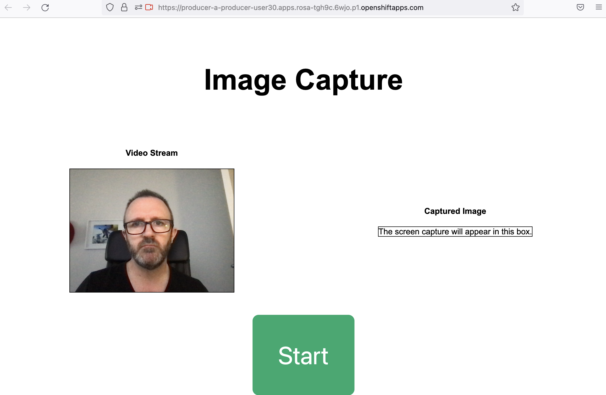
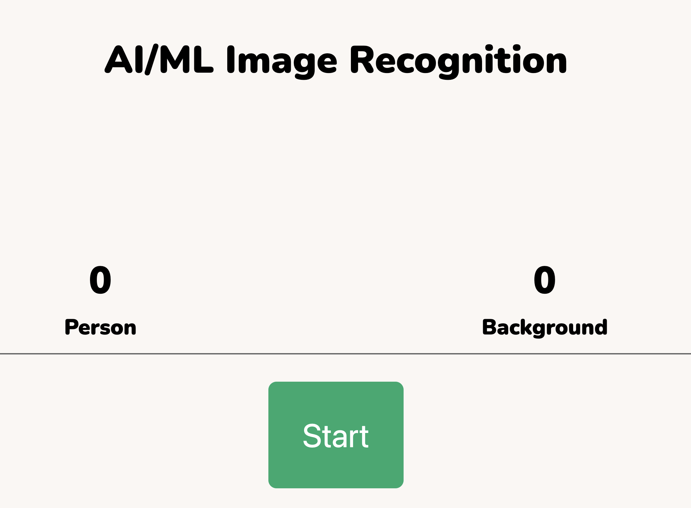

# Running the Inference Demo

## 1 - Start your Image Capture on the producer web page
You should already have opened this page while [setting up the inference demo](https://github.com/odh-labs/predictive-maint/blob/main/docs/image-detection-1-inference-demo-setup.md). You should see yourself on the screen. 

**Click start** 

Keep yourself in the webcam frame. The page will begin capturing images and sending them to Kafka.
 

## 2 - Start your Dashboard web page\
Now it's time to start your Dashboard web page - to detect what the AI model is detecting in real time

You should already have opened this page while [setting up the inference demo](https://github.com/odh-labs/predictive-maint/blob/main/docs/image-detection-1-inference-demo-setup.md). You should see yourself on the screen. 

**Click Start** 

 

The page will begin polling S3 object storage for what the AI is detecting. As you are being captured, ***Person*** will start in crementing every second. 

Put your hand in front of your webcam - so it's not seeing you. ***Background*** will start incrementing.

## 3 - Summary Recap

The diagram below summarises what is happeing in this demo
- an Edge based image capture/producer application pulls images in realtime from your webcam. The AI Model ihas been trained to recognise people - or anything else - which is labels as *background*. This capture/producer application is running on Kuberntees (OpenShift) but it could easily be modified to run something like podman or docker - suitable in low power edge environments
- This capture/producer application pushes images (1 per second) to a cloud based Kafka service hosted by Red Hat.
- on AWS a controlling application, a Kubernetes (OpenShift) ***pod*** does the following
  
  1) sends each image it pulls from Kafka to an AI Model that returns a prediction of what it is, either ***Person*** or ***Background***
  2) writes to S3 Object Storage the total count of how many times it detected ***Person*** or ***Background***

- the dashboard webpage polls S3 Object Storage every second for the current count of ***Person*** or ***Background***. This results in a near realtime update of what your webcam sends to what's displayed on the webpage.

