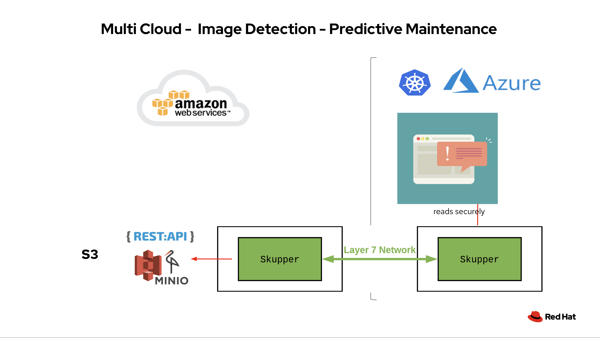
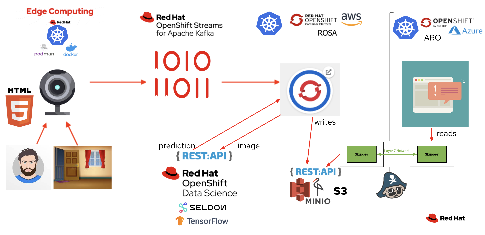

# Moving the demo to a Multi-Cloud Implementation

## Overview

In this section, we move our Dashboard component to another cloud, Azure. In doing so we utilise an exciting new component Red Hat Application Interconnect (powered by Skupper).
This simulates a scenario where we need part of our solution to another cloud, e.g. if our organisation has decided to move all reporting and dashboarding functionality to that cloud.
In utilising Application Interconnect (powered by Skupper), we can create a secure, encrypted *narrow* tunnel between a service on one cluster and a service on another cluster.

To do this, we'll move the Dashboard component to Azure's hosted OpenShift component, Azure Red Hat OpenShift (ARO).

The dashbard component architecture will look like this:
 

And the overall solution will look like this:
 


## Prerequisites 
First ensure you have met the prerequisites

### Prerequisite 1 - Setup and Run the single cluster demo

Setup and run the original single-cluster demo - including their prerequisites by following:
- [Administrator Setup](https://github.com/odh-labs/predictive-maint/blob/main/docs/administrator-setup.md)
- [Inference Demo Setup](https://github.com/odh-labs/predictive-maint/blob/main/docs/image-detection-1-inference-demo-setup.md)
- [Run Inference Demo](https://github.com/odh-labs/predictive-maint/blob/main/docs/image-detection-2-inference-demo.md)

Doing this demo will require you have a cloud based OpenShift cluster. We'll refer to this as your ROSA cluster (though your actual implemenation doesn't strictly need to be ROSA).

### Prerequisite 2 - Download and install the Skupper CLI.

Navigate to [https://skupper.io/install/index.html](https://skupper.io/install/index.html). Download, unzip and install the CLI and add it to your path as described on the webpage.

For simplicity, running this command then addd it to path works on a Mac
```
curl https://skupper.io/install.sh | sh
```

### Prerequisite 3 - A new OpenShift cluster on a different Cloud - with Admin rights.

In order to demonstrate this cross cluster functionality, you need a new OpenShift cluster ideally on a different cloud. We'll assume this is Azure Red Hat OpenShift (ARO), though that is flexible if you want to use another cloud/cluster.

Red Hatters and partners can use RHPDS. 

Others can create one by following the instructions [here](http:/try.openshift.com).

We're now ready to begin. 

## Steps to setup

### 1 - Install the dashboard in a new namespace on the ARO cluster

First login to your ARO cluster, [as you did earlier](https://github.com/odh-labs/predictive-maint/blob/main/docs/image-detection-1-inference-demo-setup.md#login-to-your-openshift-cluster-using-both-browser-and-terminal)

Run the following commands
```
oc new-project aro-dashboard
oc new-app https://github.com/odh-labs/predictive-maint.git  --context-dir=dashboard  --name=dashboard -e MINIO_URL=http://minio-ml-workshop:9000
oc create route edge --service=dashboard
```

### 2 - Install Application Interconnect (Skupper) on both OpenShift Clusters
Install Application Interconnect (Skupper) in Openshift namespaces within each of your clusters:
- your original ROSA cluster
- your new ARO cluster
(As described in the [Application Interconnect (Skupper) installation guide](https://skupper.io/start/index.html))

Now initialise Application Interconnect (Skupper) on ARO - which you are currently logged into. Run the following
```
oc project aro-dashboard
skupper init
```

Now initialise Application Interconnect (Skupper) on ROSA. Login on the terminal [as you did earlier](https://github.com/odh-labs/predictive-maint/blob/main/docs/image-detection-1-inference-demo-setup.md#login-to-your-openshift-cluster-using-both-browser-and-terminal). Then run the following commands
```
oc project a-dashboard
skupper init
```


## 4 - Link Skupper

Login to the skupper consoles on both namespaces
Link the namespaces by copying the token and pasting into the other

## 5 - Expose MINIO service

Expose the minio service with HTTP on port 9000.


## 6 - Check the dashboard connects

Now find the dashboard and check it connects to the minio service

## 7 - Scale down the old dashboard

You can now scale down the initial dashboard deployed in the first cluster.
