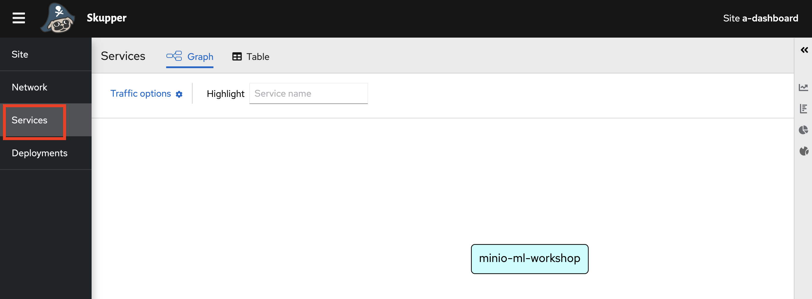

# Moving the demo to a Multi-Cloud Implementation

## Overview

In this section, we move our Dashboard component to another cloud, Azure. In doing so we utilise an exciting new component *Red Hat Application Interconnect (powered by Skupper)*.
This simulates a scenario where we need part of our solution to another cloud, e.g. if our organisation has decided to move all reporting and dashboarding functionality to that cloud.
In utilising *Application Interconnect (powered by Skupper)*, we can create a secure, encrypted *narrow* tunnel between a service on one cluster and a service on another cluster.

To do this, we'll move the Dashboard component to Azure's hosted OpenShift component, Azure Red Hat OpenShift (ARO). And we'll connect securely to the existing Minio Object storage implemenation on on ROSA to display the live data on the now Azure located webpage. 

The dashbard component architecture will look like this:
 

And the overall solution will look like this:
 


## Prerequisites 
First ensure you have met the prerequisites

### Prerequisite 1 - Setup and Run the single cluster demo

Setup and run the original single-cluster demo - including their prerequisites by following:
- [Administrator Setup](https://github.com/odh-labs/predictive-maint/blob/main/docs/administrator-setup.md)
- [Inference Demo Setup](https://github.com/odh-labs/predictive-maint/blob/main/docs/image-detection-1-inference-demo-setup.md)
- [Run Inference Demo](https://github.com/odh-labs/predictive-maint/blob/main/docs/image-detection-2-inference-demo.md)

Doing these demos will require you have a cloud based OpenShift cluster. We'll refer to this as your ROSA cluster (though your actual implemenation doesn't strictly need to be ROSA). You will also now have the ***oc*** Command Link Interface (CLI) tool.

### Prerequisite 2 - Download and install the Skupper CLI.

Navigate to [https://skupper.io/install/index.html](https://skupper.io/install/index.html). Download, unzip and install the CLI and add it to your path as described on the webpage.

For simplicity, running this command works on a Mac. Then add it to your path
```
curl https://skupper.io/install.sh | sh
```

### Prerequisite 3 - A new OpenShift cluster on a different Cloud - with Admin rights.

In order to demonstrate this cross cluster functionality, you need a new OpenShift cluster ideally on a different cloud. We'll assume this is Azure Red Hat OpenShift (ARO), though that is flexible if you want to use another cloud/cluster. You'll also need your existing (likely ROSA) cluster.

To get the ARO cluster, Red Hatters and partners can use RHPDS. Others can create one by following the instructions [here](http:/try.openshift.com).

We're now ready to begin. 

## Steps to setup

### 1 - Using the ***oc*** CLI, login to both your old cluster (ROSA) and your new cluster (ARO)
We need to login to both clusters and use a quick way to context switch between clusters with the **oc** CLI. This is because we'll be switching back and forth configuring both clusters.

First login to your new ARO cluster, [in the same way you did earlier](https://github.com/odh-labs/predictive-maint/blob/main/docs/image-detection-1-inference-demo-setup.md#login-to-your-openshift-cluster-using-both-browser-and-terminal)

Logging into a cluster will create some login data in a file called ***config*** in your ***$HOME/.kube/*** directory. Setting the environment variable **KUBECONFIG** to that file sets the ***oc logged-in context*** to that cluster.

Run the following to save the ARO *logged-in* context:
```
cp $HOME/.kube/config $HOME/.kube/config-aro
```
Now login to your existing ROSA cluster, [in the same way you did earlier](https://github.com/odh-labs/predictive-maint/blob/main/docs/image-detection-1-inference-demo-setup.md#login-to-your-openshift-cluster-using-both-browser-and-terminal)

Run the following to save the ROSA *logged-in* context:
```
cp $HOME/.kube/config $HOME/.kube/config-rosa
```

Now we can quickly switch our ***oc*** context to ARO by executing
```
export KUBECONFIG=$HOME/.kube/config-aro
```
Similarly we can quickly switch our ***oc*** context to ROSA by executing
```
export KUBECONFIG=$HOME/.kube/config-rosa
```

### 2 - Install the dashboard in a new namespace on the ARO cluster

Add the dashboard to your ARO cluster

Run the following commands
```
export KUBECONFIG=$HOME/.kube/config-aro
oc new-project aro-dashboard
oc new-app https://github.com/odh-labs/predictive-maint.git  --context-dir=dashboard  --name=dashboard -e MINIO_URL=http://minio-ml-workshop:9000
oc create route edge --service=dashboard
```

### 2 - Install Application Interconnect (Skupper) on both OpenShift Clusters
Install Application Interconnect (Skupper) in Openshift namespaces within each of your clusters:
- your original ROSA cluster
- your new ARO cluster

(To learn more, see [Application Interconnect (Skupper) installation guide](https://skupper.io/start/index.html), on which these instructions are based)

First we'll initialise Application Interconnect (Skupper) on ARO. Run the following, that includes some login credentials (feel free to modify with your desired credentials)
```
export KUBECONFIG=$HOME/.kube/config-aro
oc project aro-dashboard
skupper init --console-user admin --console-password admin1
```

Now initialise Application Interconnect (Skupper) on ROSA. Then run the following commands, again feel free to modify the credentials.
```
export KUBECONFIG=$HOME/.kube/config-rosa
oc project a-dashboard
skupper init --console-user admin --console-password admin1
```


## 4 - Link Application Interconnect (Skupper)

Next you'll login to the Application Interconnect (Skupper) consoles on both namespaces on both clusters. To visualise what's happening.

On ARO, choose the Administrator view and select your aro-dashboard project. Then navigate to **Networking > Routes**. A new *Skupper* Route has been added. Click the *Skupper* Route's URL as shown:

 

Enter the credentials *admin* and *admin1* (or your equivalents) and click **Sign In**


You'll see an interface like this:

Keep your Application Interconnect (Skupper) web interface open.


Now On ROSA, do the exact same thing, this time with the ***a-dashboard*** project selected. Keep your Application Interconnect (Skupper) web interface open.


Next you do the actual linking using the Skupper CLI. Create a token in ARO as follows:
```
export KUBECONFIG=$HOME/.kube/config-aro
oc project aro-dashboard
skupper token create ~/aro.token
```
Use that token in ROSA as follows:
```
export KUBECONFIG=$HOME/.kube/config-rosa
oc project a-dashboard
skupper link create ~/aro.token
```

## 5 - Enable your MINIO service for Application Interconnect (Skupper)

Expose the Minio service on ROSA with HTTP on port 9000 by executing the following.
```
export KUBECONFIG=$HOME/.kube/config-rosa
oc project a-dashboard
skupper expose deployment/minio-ml-workshop  --port 9000
```

## 6 - View your connections on the dashboard

Now on ROSA's Application Interconnect (Skupper) web interface, click **Network**. You'll see the respective namespaces connected from ROSA to ARO: 

Click on the Services tab and you'll see the *minio-ml-workshop* service under management by *Application Interconnect (Skupper)*


The same *Network* and *Services* visualisations are available in the *Application Interconnect (Skupper)* web interface on ARO.

## 7 - Scale down the old dashboard

You can now scale down the initial ROSA based dashboard - in order to save resources.
Now in ROSA, navigate back to **Developer Perspective > Topology**, ensure the *a-dashboard* project is selected and click on the **Dashboard* circular icon.


You'll see the deployment view. Click the **Details** tab


Click the down arrow to scale down the ROSA dashboard to zero pods to take it out of comission and consume zero resources.


You're now ready to run the Multi-Cloud / Multi-Cluster version of the demo, using *Application Interconnect (Skupper)*

To do that, open the next document [https://github.com/odh-labs/predictive-maint/blob/main/docs/image-detection-4-interconnect-demo.md](https://github.com/odh-labs/predictive-maint/blob/main/docs/image-detection-4-interconnect-demo.md)
