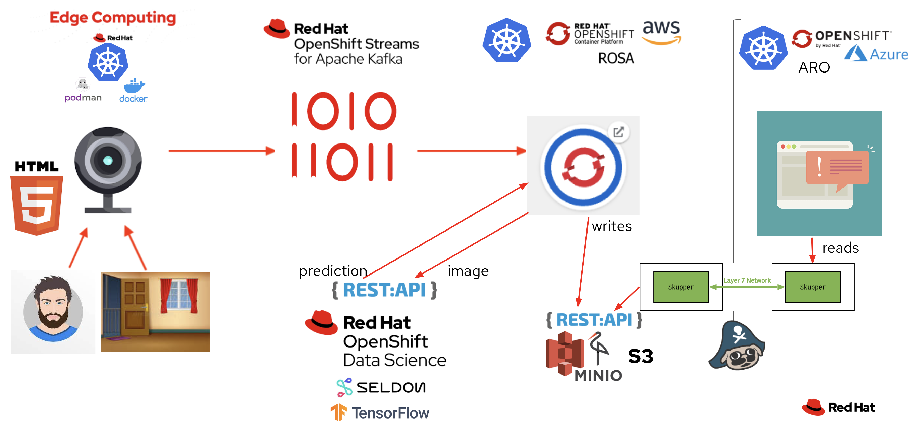

# Running the Application Interconnect (Skupper) Demo

Note what follows is almost identical to what you did when you ran this all in ROSA in the earlier demo [Running the inference demo](https://github.com/odh-labs/predictive-maint/blob/main/docs/image-detection-2-inference-demo.md). The only difference is we run the Dashboard in a different cluser (in ARO) as discussed earlier and as shown here:
 

In ROSA, with the *a-producer* project selected, navigate to **Developer Perspective > Toplogy** and click the **Route link** as shown:
 

You'll get a warning the application is trying to access your webcam - accept that warning.

You'll see youself on the screen. 

**Click start** 

The page will begin capturing images and sending them to Kafka.

 

Now on your ARO cluster web interface, with the *aro-dashboard* project selected, navigate to **Developer Perspective > Toplogy** and click the Dashboard's **Route link** as shown:
 

You should see this web page. Click start.

1 - With you in visible in the webcam in the ROSA based producer app, the *Person* counter will start incrementing.

2 - Put your hand in front of the webcam so it can't see you. The *Background* counter will start incrementing.
 

## 6 - Demo Complete

Congratulations, you have completed the Multi-Cloud/Multi-Cluster realtime Edge-Cloud demo. Thanks to *Application Interconnect (Skupper)*, your dashboard is connecting securely over an encrypted connection back to your ROSA based Minio object storage, to retrieve in real time the count of what the AI Model has detected from the incoming images!

