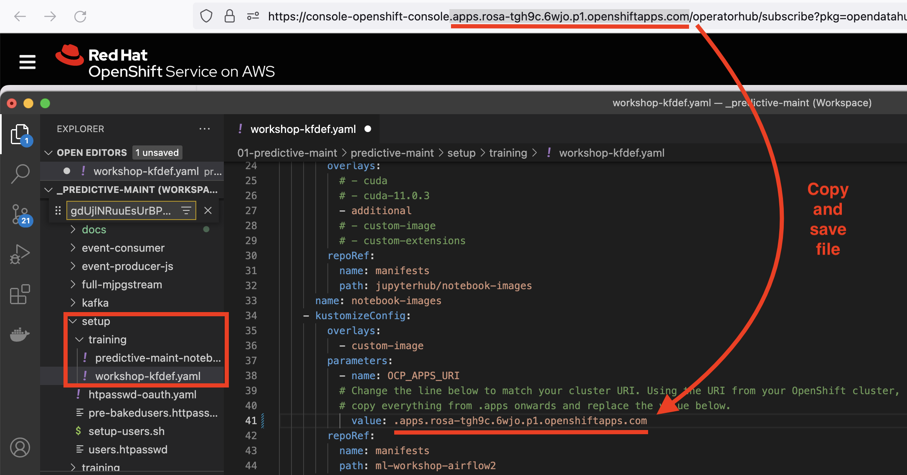
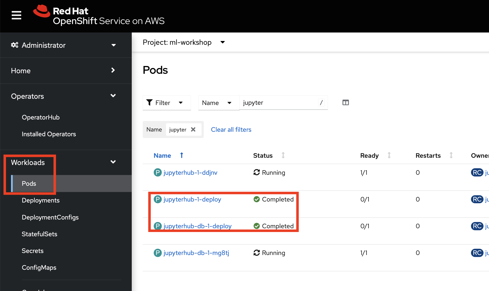
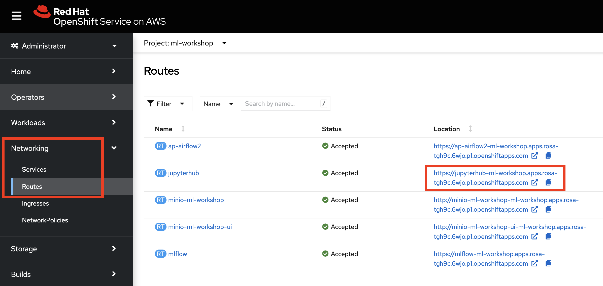
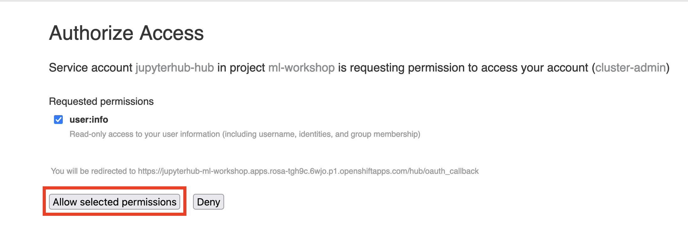
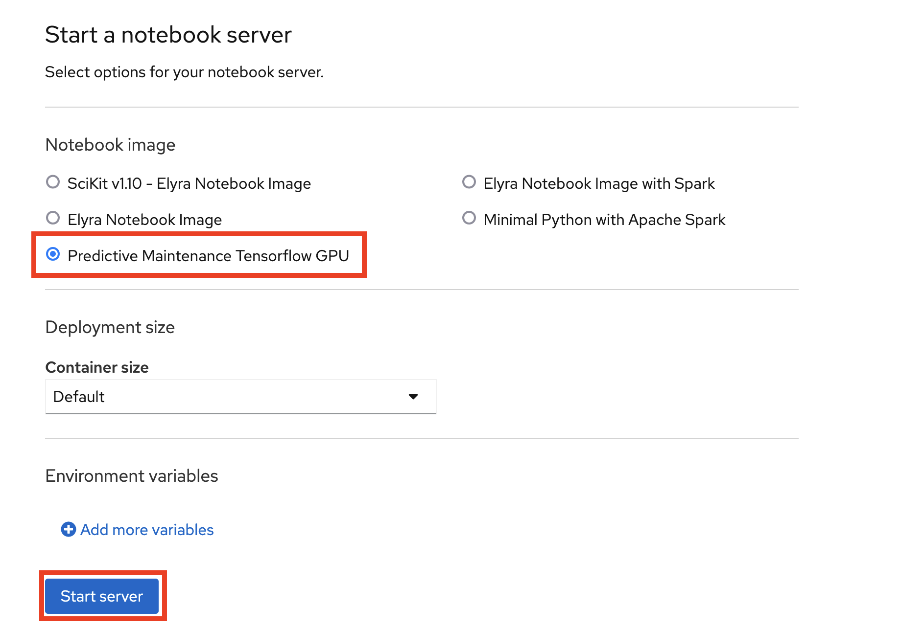
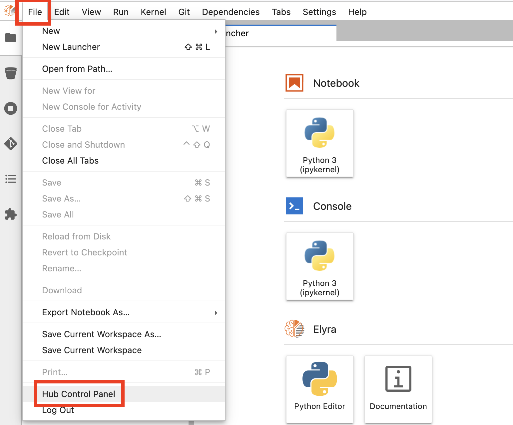
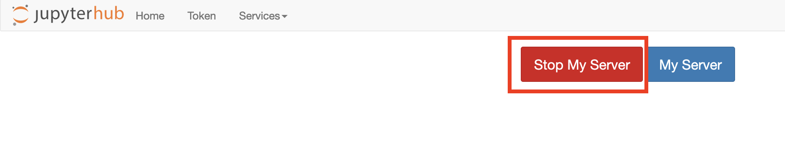
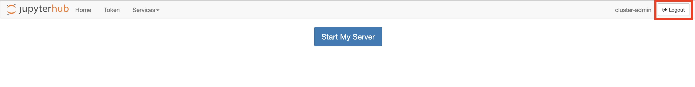

# Setting up the AI Model Training Demo

## Here we give you the one-off steps you will need to run prior to your or your students running the AI Model training demo/workshop.

We are going to create, train and deploy an equivalent model we used previously to detect objects in the realtime streaming images from our webcam via Kafka.

## 1 - Install the Open Data Hub's Jupyter notebook component

Do the following
- Navigate to the setup/training subdirectory where you have have cloned this repo. 
- Open the file *workshop-kfdef.yaml*. 
- Go to line 41 and remove the value starting at ***.apps.***
- In your browser, copy the equivalent part of the address starting at ***.apps.*** ending in ***.com***. Paste that into line 41 where you removed what was there. Save the file

***NOTE - ensure line 41 starts a . (dot) as shown***

   

   - Now install the Open Data Hub components, defined in *workshop-kfdef.yaml* in your ml-workshop project
   ```
   oc project ml-workshop
   oc apply -f $REPO_HOME/setup/training/workshop-kfdef.yaml
   ```

- In OpenShift's Administrator view, navigate to **Workloads > Pods**
   Filter on *jupyter*. As soon you see your two *deploy* pods completed, you're ready to open Jupyter
   

- Navigate to **Networking > Routes**
   Click on the *jupyter* Route
   

- Login using your OpenShift credentials

- On the Authorise Access popup screen, click *Allow selected permissions*
   
- On the Spawner page, select the image *** Predictive Maintenance Tensorflow GPU*** and then **Start Server** as shown below. This will take a few minutes. It's better to do this now, as we want this image to be downloaded to our cluster so it's faster when our students do it later.
   

- As soon as you are into Jupyter, shut down the server by clicking 
  - **File > Hub Control Panel**   
  
  - then click **Stop My Server**
  

  - then click **Logout**.
      


You're now ready to do the demo/workshop. 

Go to the next section [image-detection-6-train-model-demo.md](https://github.com/odh-labs/predictive-maint/blob/main/docs/image-detection-6-train-model-demo.md)

