# Setting up the Inference Demo


### Prerequisite 1 - Download and unzip the edge-based virtual box for this workshop. 
We've created a virtual machine (VM) you'll run in VirtualBox. It contains all of the libraries, binaries, command line interfaces etc, that you'll need to 
- interact with, setup and configure your Kafka Streaming service
- interact with, setup and configure your OpenShift based applications, which will - 
  - make the inference calls to the AI prediction service using pulled in realtime from your Kafka Streaming service
  - push the results to your own OpenShift based Object Store S3 implemenation
- retrieve images from your webcam feed in realtime and push them to your Kafka Streaming service

Hit this URL to download this virtual box
[https://www.dropbox.com/s/o3tsofeix3eocj2/Fedora-VB3.ova?dl=0](https://www.dropbox.com/s/o3tsofeix3eocj2/Fedora-VB3.ova?dl=0)

You may be prompted to login. It's not required, just click the **X** to close the dialog:

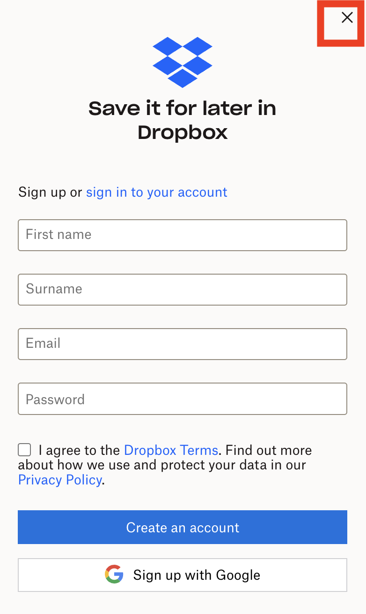


Then click download:
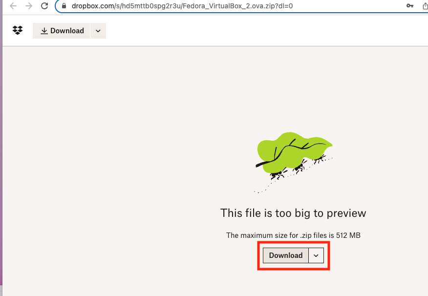


Depending on your internet speead, this can take several minuites. 

Once it's complete unzip the file - by double clicking on it...


### Prerequisite 2 - Install Virtual Box and its extension pack.
Instructions to do it are contained on the [Virtual Box Download page](https://www.virtualbox.org/wiki/Downloads). But in short:
 - 1 - Download Virtual Box
 - 2 - Download the extension pack
 
 Then
 - Install Virtual Box
 - Grant access to vistual box to your camera, microphone etc
 - Install the extension pack

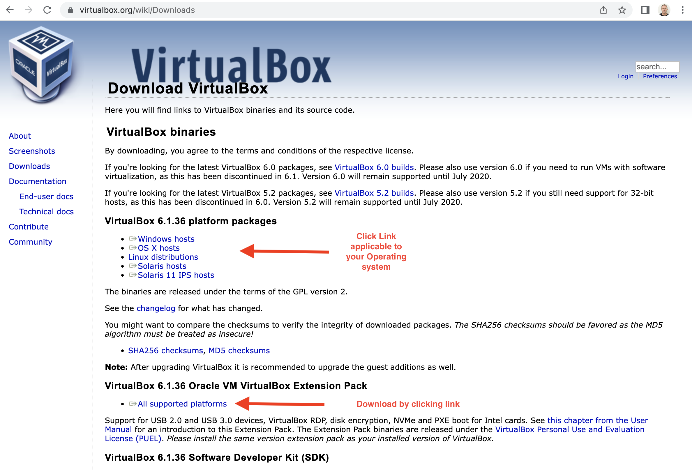


### Prerequisite 3 - a Red Hat Account
Next, if you don't already have one, set up a free Red Hat Account - where the SaaS service, Red Hat OpenShift Service for Apache Kafka (RHOASAK) is located. Do that at **https://console.redhat.com**. Logout


### Prerequisite 4 - an OpenShift cluster, a Username and an OpenShift project to work in
You instrutor will supply these to you in the Web Meeting Chat. We'll refer to these below as
```
YOUR OPENSHIFT INFERENCE PROJECT	
YOUR OPENSHIFT USERNAME	
YOUR OPENSHIFT PASSWORD
OPENSHIFT CLUSTER URL
```
Once these there are complete, you're ready to begin. 

## 1 - Open virtual box then open a terminal inside your virtual box. 
On your laptop, open Virtual Box. A screen like this will appear. 
Click **Import**:
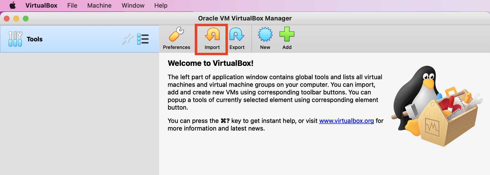
- keep the source *Local File System*
- click the file icon
- navigate to where you unzipped the VM earlier
- select the ***ovf*** file
- click Open
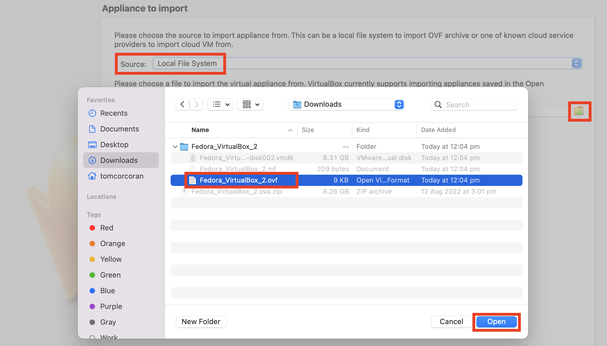

On the next screen click **Continue**
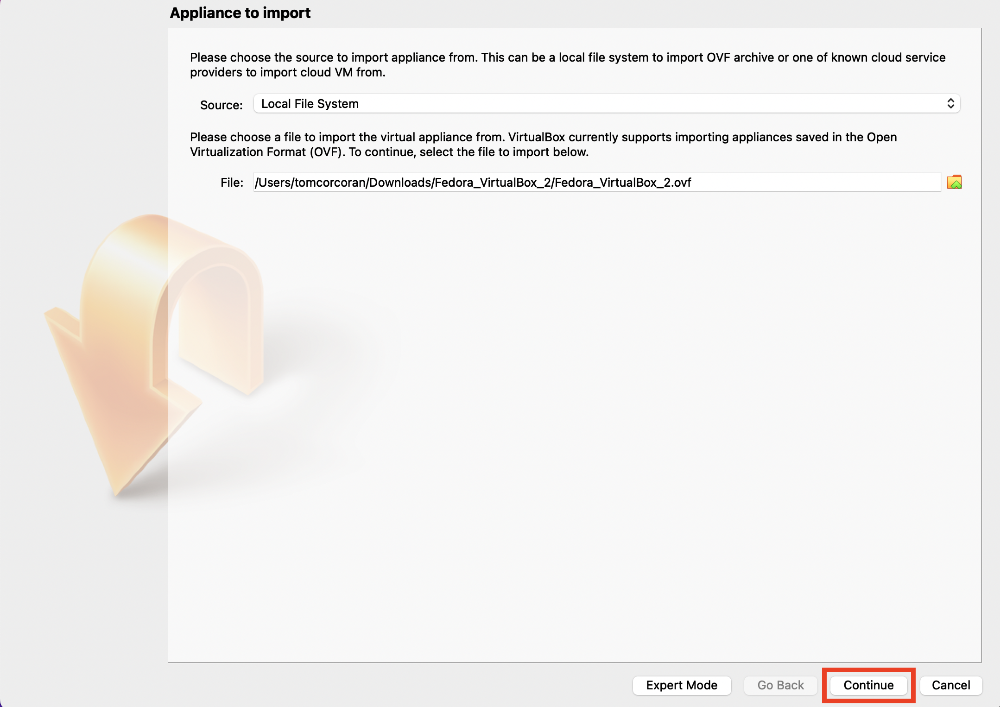

On the following screen, accept the defaults and click **Import**
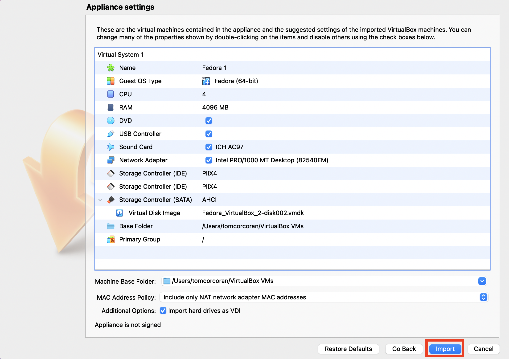

Shortly after, your virtual machine will be available. Click **Start**
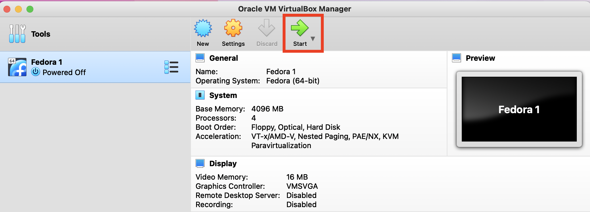

Enlarge the window and login using the default username ***redhat*** and the password also ***redhat***

You'll see a screen like this. Click the *App Launcher* menu on the bottom. If you don't see it click *Activities* on top.
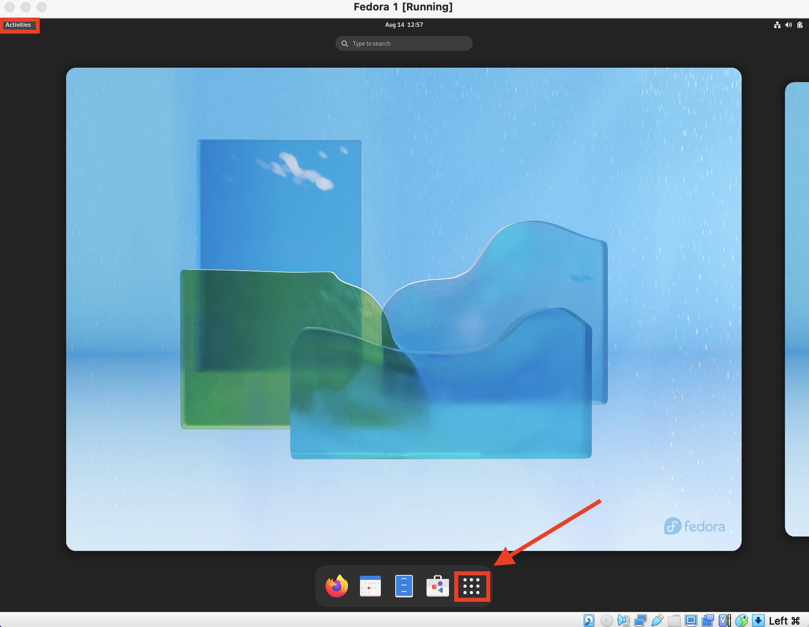

Click **terminal**
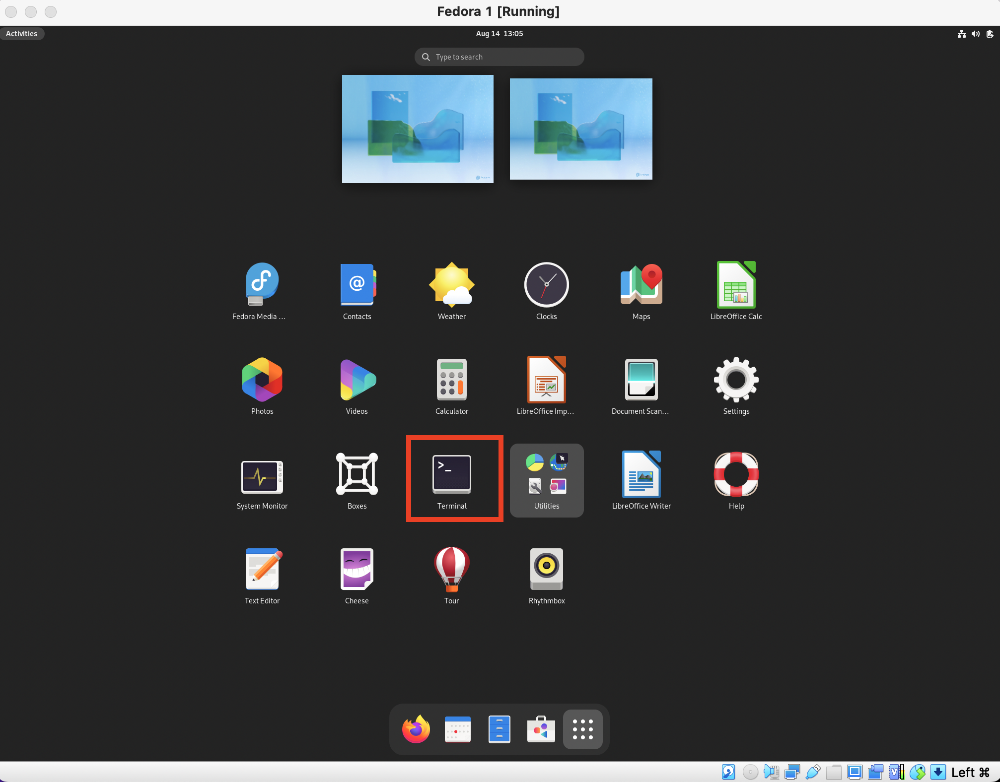

The Github repository containing this documentation you're reading also contains all source code, scripts, yaml etc that you will need to run this workshop.
We have already cloned this repository into the VM, so you'll just to change directory to it. We'll also set a variable to refer to this directory ***REPO_HOME***. Run the following inside the terminal window:
```
cd predictive-maint
export REPO_HOME=`pwd`
```
***Note - if you want to paste commands from this document to the terminal use this keyboard shortcut***
```
SHIFT + CONTROL + v
```

## 2 - Setup Kafka Cluster on Red Hat OpenShift Streams for Apache Kafka (RHOSAK)
In this section, we're going to automate the configuration of your Kafka streaming service and slot the values from ***your*** new Kafka configuration into various source files so they're ready to use later. Your Kafka streaming service is where
 - images will be sent from your laptop in realtime
 - those same images will be pulled in realtime for your inferencing application on OpenShift


Now, using the terminal inside your virtual box, run the following Kafka automation script
```
cd $REPO_HOME/deploy
. ./kafka.sh
```

You'll be prompted login to your Red Hat Account (you set up previously). A confirmation page like the following will appear on your browser

 

... as well as confirmation on the terminal:
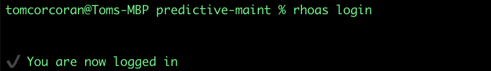

This script will take several minutes to complete. Keep the terminal open, allowing it to continue the Kafka configuration. 
Feel free to continue from the section below 
***3 - Login to OpenShift and select your YOUR OPENSHIFT INFERENCE PROJECT*** - and come back to the script after 6-7 minutes


### Confirm your Kafka installation
After 5-7 mins, your ***kafka.sh*** script should have completed successfully.
Verify it by doing the following:
- Scan your terminal output - it should have run to completion with no errors. The end should look something like this if it was successful:
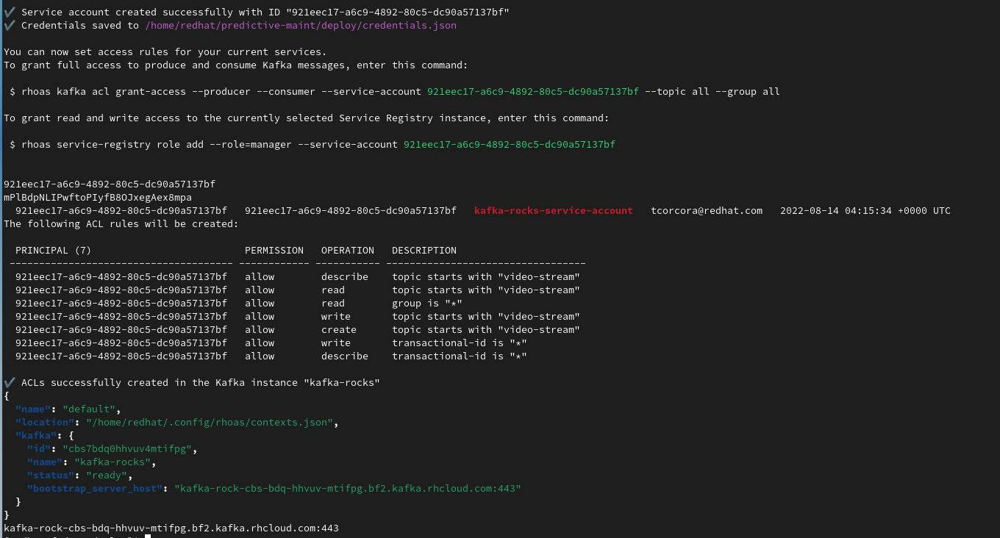

#### Verify creation of your cloud based Kafka service (RHOASAK)
- navigate to [https://console.redhat.com/application-services/streams/kafkas](https://console.redhat.com/application-services/streams/kafkas)
and you should see a new Kafka cluster called  ***kafka-rocks*** created.


#### Verify your ***consumer-deployment.yaml*** file. 
We have a simple OpenShift based application that you will run shortly which
- pulls images from our video-stream Kafka topic
- for each one, it calls the AI model for a prediction on what each image contains
- writes the count of what it found out to our Object Storage Minio
  
In the ***kafka.sh*** automation script we ran earlier, we configured ***consumer-deployment.yaml*** with various values relating to your Kafka installation. [This link shows you the original part of consumer-deployment.yaml](https://github.com/odh-labs/predictive-maint/blob/main/deploy/consumer-deployment.yaml#L49-L54) before we substitued those values. Notice we have 3 placeholders:


These 3 placeholders in your consumer-deployment.yaml should ***now have your values*** . To verify this has been successful, run the following and navigate down to lines 49-54.
```
cat $REPO_HOME/deploy/consumer-deployment.yaml
```
It should look something like this - though your values will be different:
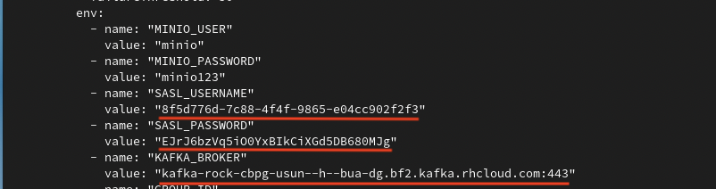


## 3 - Login to OpenShift and select your OpenShift project

#### Login to your OpenShift cluster using both browser and terminal
1. Log on to OpenShift - by hitting the URL ***OPENSHIFT CLUSTER URL*** you got off the Web Meeting Chat earlier. You'll see this screen. Click **openshift-users** 
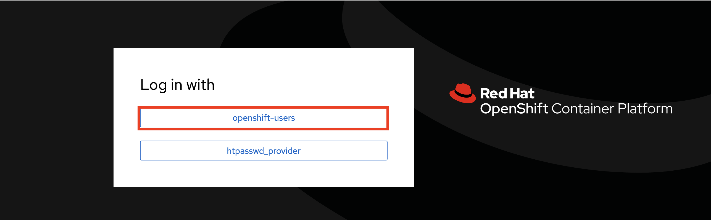
2. Enter these values    
   - ***YOUR OPENSHIFT USERNAME*** that you got earlier from your instructor
   - ***openshift*** for your password 
3. Click **Log In**
 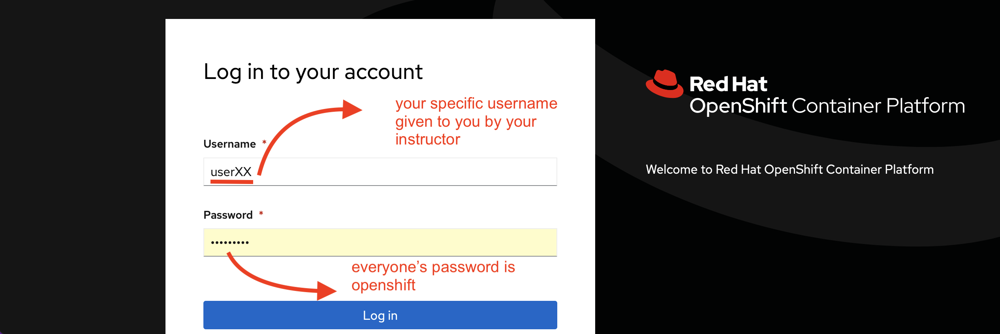 


3. Click the *Perspective* dropdown list box
4. Click the *Administrator* perspective\
   OpenShift changes the user interface to the Adminstrator perspective.
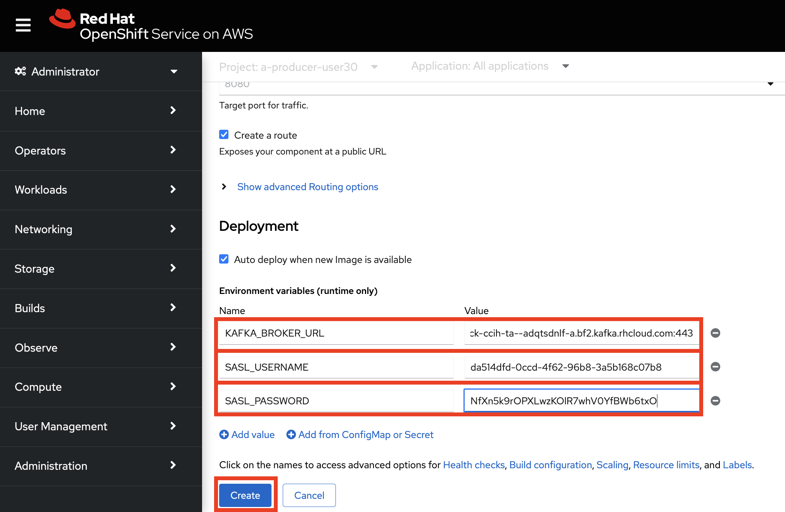
5. Click your username on the top right of the screen, then click *Copy Login Command*
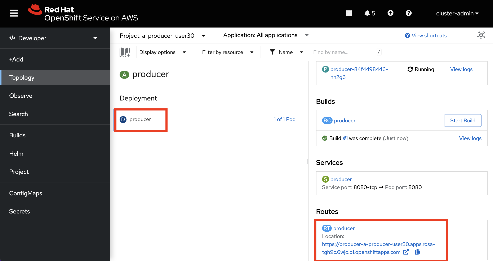

Log in and click **Display Token**. 


Copy the entire ***oc login*** command as far as ***6443*** and paste into your terminal window inside virtual box. Accept the *insecurity* warning.

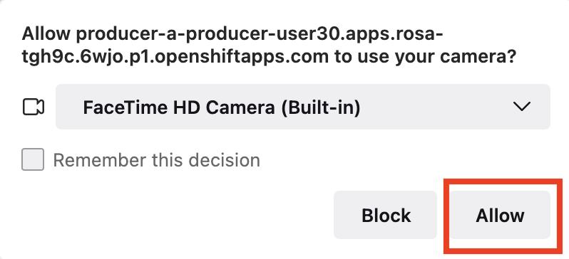

#### Select your OpenShift project
Now select your project inside the terminal window. Run the following replacing ***YOUR OPENSHIFT INFERENCE PROJECT*** with yours
   ```
   oc project <insert YOUR OPENSHIFT INFERENCE PROJECT here>
   ```
   i.e. in my case, as I'm user30:

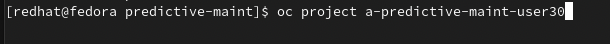 

Now on the OpenShift Web console (either within or outside your Virtual box VM), navigate to Home > Projects and click ***YOUR OPENSHIFT INFERENCE PROJECT***, in my case *a-predictive-maint-user30*
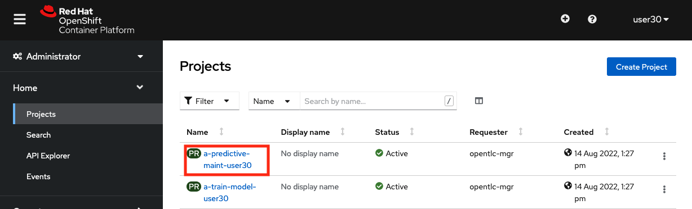 


## 4 - Configure OpenShift's model serving component (Seldon) and based object storage (Minio) 

#### Install the Seldon Deployment

Seldon is an awesome tool to expose an AI model behind a RESTful API.

1. In your terminal, run the following
  ```
   oc apply -f $REPO_HOME/deploy/Seldon-Deployment.yaml
   ```

2. Navigate to **Operator Hub > Installed Operators**. Click **Seldon Operator** 
 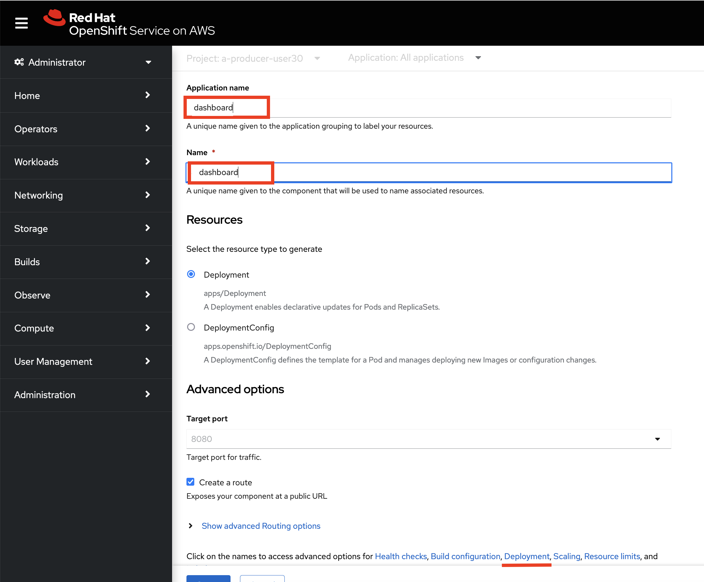

3. Click **Seldon Deployment** and notice there is a new one called ***model-1*** whose status is ***Creating***. Come back to this in a few minutes and it should have changed to ***Available***
 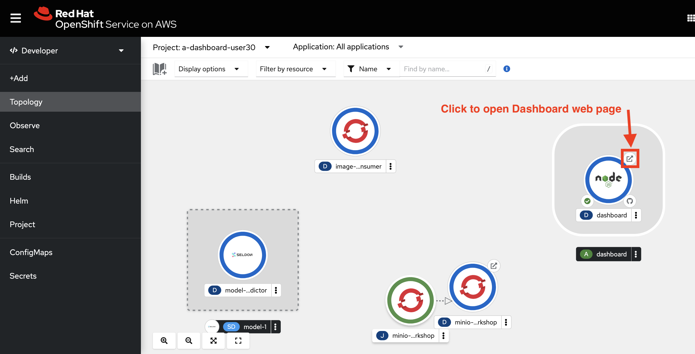

4. Navigate to **Workloads > Pods**. This shows your pods or running containers within your project. You should see 30 pods instanciating, each of which should change to status *Running* after a couple of minutes.
 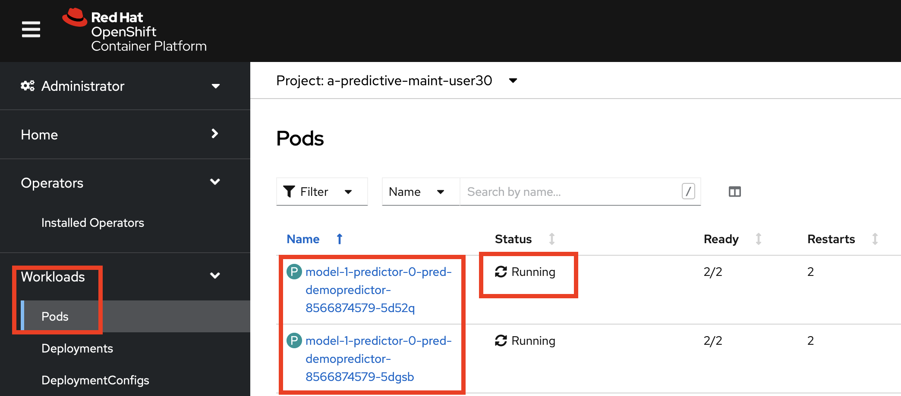


### Install Minio, our lightweight Object Storage implementation

1. In your terminal window, type the following commands:
   ```
   oc apply -f $REPO_HOME/deploy/minio-full.yaml
   ```
   You should be informed of a series of Kubernetes object creations.

2. Now switch to your OpenShift web console again. Navigate to **Workloads > Pods** and filter on *minio*. After a couple of minutes, you should see a running container like so. (ignore any temporary ***CrashBackoff*** status of the other pod).
 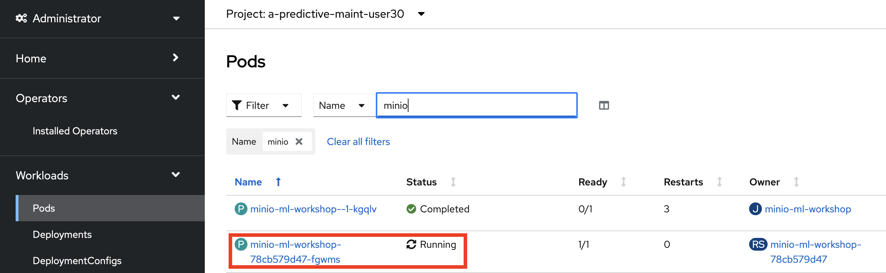

3. Navigate to **Networking > Routes**. Notice there are 2 ***Minio*** routes    
   - one for the UI 
   - one for the API (without the ***ui*** suffix)
 

   1. Copy the API one and paste it somewhere for later. We'll refer to this as your ***FULL_MINIO_API_ROUTE***.
   2. Open the UI one - by clicking on the URL under *Location*. Log in using username/password ***minio*** and ***minio123***. You'll see a bucket called *image-prediction*. Here we'll keep a count of the the number of objects the model detected in the streaming feed.
   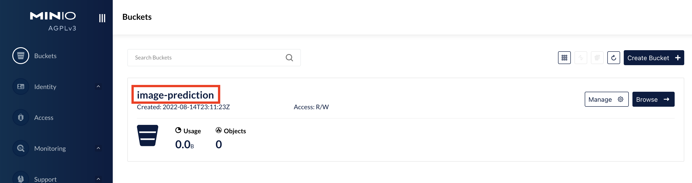


## 5 - Check back on your Kafka Automation script.
Recall above we advised you to check back in a few minutes on your Kafka automation script. Now is probably a good time to do that - as described above at ***Confirm your Kafka installation***


## 6 - Setup Complete
Now your inference application is ready. We'll use it in the next instruction file, [Run End to End Inference Demo](https://github.com/odh-labs/predictive-maint/blob/main/docs/image-detection-inference-demo.md)

